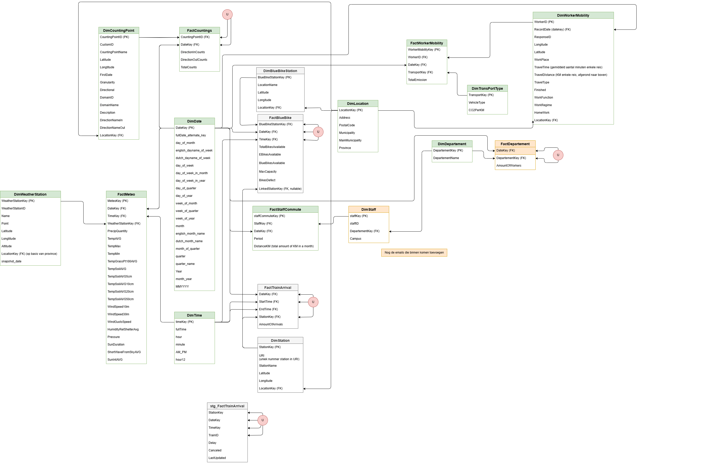

# Data Engineering Project I 2025-2026

## Groepsleden

| Naam          | GitHub username                         |
| :------------ | :-------------------------------------- |
| Luiz Verheyen | [Luiz](https://github.com/LuizVerheyen) |
| Evy Coulier   | [Evy](https://github.com/EvyCoulier)    |
| Arne Bogaert  | [Arne](https://github.com/ArneBogaert)  |

## Over dit project

Dit project kadert binnen het vak **Data Engineering Project I (DEPI)** aan HOGENT.
De repo bundelt de ETL-scripts, DWH-setup, validaties, analyses en ondersteunende assets
voor een data engineering pipeline rond **duurzame mobiliteit**.

De focus van het project ligt op:

- fietsgebruik en telpalen
- weerdata en correlaties met mobiliteit
- Blue-bike beschikbaarheid
- NMBS aankomstdata
- fietsvergoedingen van personeel
- mobiliteitsbevragingen van studenten en medewerkers

## Context

HOGENT wil op termijn klimaatneutraal werken. Mobiliteit is daarin een belangrijke bron
van uitstoot. Met dit project bouwen we een Data Warehouse en ETL-flow waarmee
mobiliteitsdata uit verschillende bronnen samengebracht, verrijkt en gecontroleerd wordt.

## Architectuur in deze repo

De huidige repository bevat deze onderdelen:

1. **Data gathering** scripts in Python
2. **Transformaties van de data** naar DWH-structuur
3. **Microsoft SQL Server DWH** met DDL en constraints
4. **Testlaag** met unit tests en SQL-validaties
5. **Analyses** in pandas notebooks en Power BI
6. **Machine Learning** analyses en een interactief Streamlit dashboard
7. **REST Web API** om de data openbaar te maken



## Databronnen

### Telpalen

- Belgische fietstelpalen via Eco-Counter / Fietsflow
- metadata van telpunten
- tellingen per datum
- verrijking met locatiegegevens

### Weerdata

- `aws_1day.csv`
- `aws_station.csv`
- station snapshots
- dagmetingen voor weeranalyse

### Blue-bike

- locaties van Blue-bike stations
- beschikbaarheid van fietsen
- koppeling met nabijgelegen NMBS-stations

### NMBS

- trein aankomsten
- staging + promotie naar facttabel

### Personeel en fietsvergoeding

- departementssnapshots
- personeelsdata
- ritgegevens voor fietsvergoeding

### Mobiliteitsbevragingen

- studentenmobiliteit
- medewerkersmobiliteit
- koppeling met transporttypes en emissies

## Projectstructuur

```text
.
|-- API/                    # Flask REST Web API
|-- DWH/
|   |-- connection/         # ETL-pipeline en validatie
|   `-- ddl schema/         # DDL.sql (database + tabellen)
|-- data/
|-- data_gathering/         # Brondata-scripts per databron
|   |-- blueBikes/
|   |-- dimDate/
|   |-- dimLocation/
|   |-- dimTime/
|   |-- email_fietsvergoeding/
|   |-- mobiliteitsBevragingHOGENT/
|   |-- NMBS/
|   |-- studentMobility/
|   |-- telpalen/
|   `-- weather/
|-- images/
|-- langChain/
|-- logging/                # Logbestanden (pipeline, webapi, unit tests)
|-- machine-learning/
|   |-- analyses/           # Notebooks per student
|   |-- group/              # Streamlit dashboard (app.py)
|   |-- models/             # Getrainde modellen (niet in git)
|   |   |-- bluebike/
|   |   |-- fietsers/
|   |   `-- weer/
|   `-- trainingscripts_models/  # Trainscripts
|-- pandas/                 # Pandas-analysenotebooks per student
|-- powerBI/
|-- tests/
|   |-- sqlTests/
|   |-- SqlTestsLeerkrachten/
|   `-- unitTests/
|-- requirements.txt
`-- README.md
```

## Machine Learning

Zie ook `machine-learning/README.md` voor gedetailleerde uitleg per analyse.

### Analyses

| Student | Reeks | Analyse | Onderwerp |
| --- | --- | --- | --- |
| Arne Bogaert | Reeks 1 | Analyse 1 | Anomaliedetectie op fietstellingen |
| Arne Bogaert | Reeks 2 | Analyse 1 | Tijdreeksvoorspelling van fietstellingen |
| Evy Coulier | Reeks 1 | Analyse 3 | Clustering van Blue-Bike stations |
| Evy Coulier | Reeks 2 | Analyse 3 | Tijdreeksvoorspelling van Blue-Bike uitleningen |
| Luiz Verheyen | Reeks 1 | Analyse 2 | Maandclassificatie op basis van weerdata |
| Luiz Verheyen | Reeks 2 | Analyse 2 | Temperatuurvoorspelling per meetstation |

### Modellen trainen

De getrainde modellen staan niet in git. Genereer ze eenmalig lokaal:

```bash
cd machine-learning/trainingscripts_models
python train_models.py     # weermodellen → models/weer/
python train_fietsers.py   # fietstellingsmodellen → models/fietsers/
python train_bluebike.py   # Blue-Bike modellen → models/bluebike/
```

### Dashboard uitvoeren

```bash
cd machine-learning/group
streamlit run app.py
```

Het dashboard laat toe om via **spraak of tekst** een voorspellingsvraag te stellen.
Een LLM (Llama 3.3 via Groq) bepaalt het onderwerp, de locatie en het aantal dagen.
Voorspellingen worden getoond als tabel en grafiek voor 1 tot 7 dagen vooruit.

## Gebruikte frameworks en libraries

De actuele dependencies staan in `requirements.txt`. Belangrijkste packages:

### Data verwerking

- pandas, numpy, openpyxl, xlrd

### Database

- SQLAlchemy, pyodbc

### Machine Learning en dashboard

- scikit-learn (IsolationForest, RandomForest, LinearRegression)
- statsmodels (Exponential Smoothing)
- joblib (model serialisatie)

### Dashboard en spraak

- streamlit
- SpeechRecognition

### AI en verrijking

- langchain-groq, groq

### Analyse en visualisatie

- matplotlib, seaborn, scipy

### Scraping en automatisering

- selenium, beautifulsoup4, playwright, simplegmail

### Testing frameworks

- pytest, unittest

## Installatie en setup

### 1. Clone de repository

```bash
git clone https://github.com/<your-username>/<repo-name>.git
cd <repo-name>
```

### 2. Maak een virtuele omgeving aan

```bash
python -m venv venv
```

Windows:

```bash
venv\Scripts\activate
```

Linux / Mac:

```bash
source venv/bin/activate
```

### 3. Installeer de dependencies

```bash
pip install -r requirements.txt
```

### 4. Voorzie een SQL Server + ODBC driver

Deze repo gebruikt Microsoft SQL Server via `pyodbc`.
Voor lokaal gebruik is `ODBC Driver 17 for SQL Server` de standaard drivernaam in de code.

### 5. Configureer `.env`

Maak een `.env` bestand aan in de root van het project:

```env
DB_SERVER=127.0.0.1,1433
DB_NAME=DEPI
DB_DRIVER=ODBC Driver 17 for SQL Server
DB_USER=sa
databasePWD=your_password
groq_API=your_groq_api_key
```

Optioneel voor sommige scripts:

```env
db_lokaal_conn=your_local_connection_string
df_VIC_conn=your_vic_connection_string
```

### 6. Zet de database op

Voer het DDL-script uit:

```text
DWH/ddl schema/DDL.sql
```

Daarin zitten:

- create database / create table statements
- foreign keys en primary keys
- non-negative check constraints
- staging tabel voor treinarrivals

## ETL uitvoeren

### Basispipeline

```bash
python DWH/connection/initiator.py
```

Deze pipeline verwerkt onder meer:

- `DimTime`, `DimDate`, `DimLocation`
- `DimWeatherStation`, `DimBlueBikeStation`, `DimStation`
- `FactMeteo`
- `DimWorkerMobility`, `DimTransportType`, `FactWorkerMobility`
- `DimDepartement`, `FactDepartement`
- `DimCountingPoint`, `FactCountings`
- `DimStaff`, `FactStaffCommute`
- `DimStudent`, `FactStudentMobility`

### Losse loaders

```bash
python DWH/connection/factWeather.py        # FactMeteo
python DWH/connection/fillerBluebikeStation.py  # FactBlueBike
python DWH/connection/fillerTrain.py        # FactTrainArrival
```

## Testing

### Unit tests

```bash
python -m pytest tests/unitTests -v
```

### Validaties van de leerkrachten

```bash
python -m pytest tests/SqlTestsLeerkrachten -v -s
```

Verwacht een werkende SQL Server met correcte `.env` configuratie.

### SQL checks

- `tests/sqlTests/queries_ter_controle_van_DWH.sql`

## Huidige status

- DWH DDL en constraints
- ETL-scripts voor alle databronnen
- Unit tests voor ETL-logica
- Database-validaties via pytest en SQL
- Notebooks voor analyse (pandas) en Power BI rapportering
- Machine Learning analyses
- Streamlit voorspellingsdashboard met spraakherkenning
- REST Web API (Flask, OpenAPI 3.0)

## Aanvullende documentatie

- `API/README.md` — endpoints, validatie, logging, Postman-testen
- `DWH/README.md` — schema, ETL-pipeline, validatie
- `machine-learning/README.md` — analyses per student, modellen trainen, dashboard
- `pandas/README.md` — pandas-analyses per student
- `logging/README.md` — logbestanden en rotatie
- `tests/TestDocumentatie.md` — teststructuur, leerkrachten-tests, unit-tests
